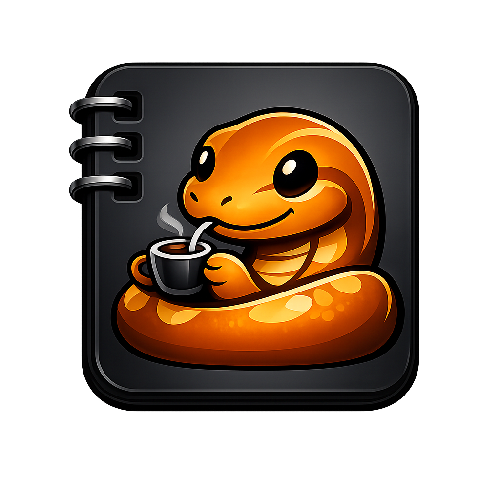

<p align="center">
  <a href="https://github.com/brunonlinespace/suite-pythoine">
    
  </a>
</p>

<h1 align="center">Suite Pythoine</h1>

<p align="center">
  <strong>Your applications. Your files. One home.</strong>
</p>

<p align="center">
  <strong>Friendly. Fast. Focused.</strong>
</p>

<p align="center">
  <a href="https://github.com/brunonlinespace/suite-pythoine">
    github.com/brunonlinespace/suite-pythoine
  </a>
</p>

Suite Pythoine is a desktop application hub for the **brunonlinespace**
software family.

It brings together focused standalone applications, richer workspace
editions, portable and managed installations, file routing, component
discovery, and application management in one consistent interface.

The individual applications remain useful on their own. Suite Pythoine
simply gives them a shared home.

---

## What is Suite Pythoine?

Suite Pythoine is designed around a simple idea:

> **Small applications should remain small applications — but they should
> still work beautifully together.**

Rather than turning every tool into one enormous program, Suite Pythoine
provides the common infrastructure around them:

- discover installed applications
- install supported components
- launch applications
- manage multiple installed versions
- open files with the appropriate application
- remember preferred file routes
- support portable and managed workflows
- expose application metadata and capabilities
- keep the component catalogue independently updateable

Applications remain free to run independently outside the Suite.

---

# Featured applications

## Markopad & Marko Plus

### Markopad

A focused Markdown editor built around a clean writing workflow.

**Markopad** keeps Markdown editing straightforward while providing the
tools needed to write, structure and preview documents without turning
the editor into an IDE.

**Focused Markdown. Clear workflow.**

### Marko Plus

**Marko Plus** takes the Markopad editing experience and adds the shared
Plus workspace infrastructure.

It combines:

- project and workspace management
- file and folder discovery
- a persistent project sidebar
- quick project selection
- richer document navigation
- **Edit**
- **Split View**
- **Preview**

Markopad remains the focused standalone editor.

Marko Plus is the workspace edition.

---

## Ricopad & Rico Plus

### Ricopad

A dedicated rich-text editor focused on **RTF**.

Ricopad provides a native document-editing environment with formatting,
lists, tables, colours, fonts, printing and persistent RTF structure.

It is deliberately a specialist editor rather than a general-purpose
office suite.

### Rico Plus

**Rico Plus** applies the same Plus workspace philosophy used by
Marko Plus to Ricopad.

It combines Ricopad's rich-text engine with the shared project and
workspace infrastructure descended from Python Lair.

**Ricopad for the document.  
Rico Plus for the workspace.**

---

## Nuxpad

Nuxpad is one of the foundational applications in the brunonlinespace
family.

Its development helped establish ideas that later evolved through
**Python Lair**, the Pad family and eventually the shared Plus workspace
architecture.

Nuxpad represents the lightweight-editor roots of the ecosystem:
focused tools, restrained interfaces and minimal friction between
opening a file and working on it.

---

## Python Lair

Python Lair occupies a special place in the history of the project
family.

The development path broadly became:

```text
Nuxpad
   ↓
Python Lair
   ↓
shared application/editor ideas
   ↓
Pad family
   ↓
extracted workspace scaffolding
   ↓
Marko Plus / Rico Plus
